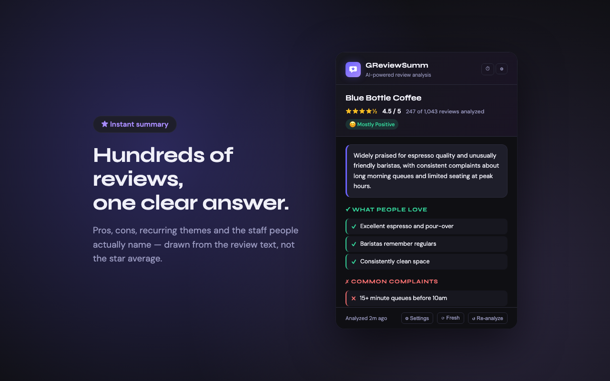
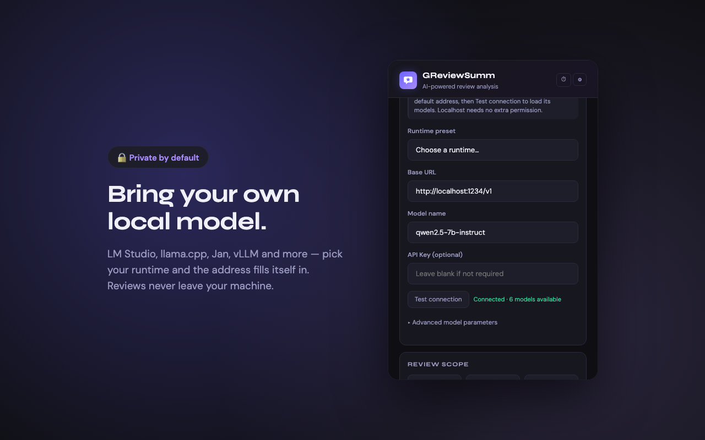

# GReviewSumm – AI Review Summarizer

A Chrome extension that instantly summarizes Google Maps reviews using AI.
Runs against **any local model** — Ollama, LM Studio, llama.cpp, Jan, vLLM and other
OpenAI-compatible servers, so nothing leaves your machine — or against a cloud
provider (OpenAI, Anthropic Claude, Google Gemini, Groq, xAI Grok) if you prefer.


---

## Features

- **Instant place info** — opens to place name, rating, review count, address, and phone with no delay
- **Auto-scroll** — automatically scrolls the reviews panel to collect up to 1,000 reviews (adjustable)
- **AI summary** — returns pros, cons, top themes, overall sentiment, and frequently mentioned staff
- **Bring your own model** — Ollama or any OpenAI-compatible local server (LM Studio, llama.cpp, Jan, vLLM, KoboldCpp, LocalAI, text-generation-webui), with one-click endpoint presets, a model picker read from the server itself, and full sampling control
- **Cloud providers too** — OpenAI, Anthropic Claude, Google Gemini, Groq, xAI Grok
- **Encrypted key storage** — API keys are encrypted at rest with AES-GCM-256; never exposed in the DOM
- **Cached results** — analysis is cached for 24 hours; history screen lets you browse and re-open past summaries
- **Time-based filtering** — analyze all reviews, the most recent N, or reviews from the last 1/3/6/12 months
- **Wrong-page detection** — friendly prompt when the extension is opened on a non-Maps tab
- **Accessible** — WCAG AA contrast throughout and a visible keyboard focus ring on every control
- **Fully offline UI** — fonts are bundled, so the popup makes no third-party requests

## Screenshots




## Website

Landing page, setup guide, privacy policy and changelog live in [`docs/`](./docs)
and are published with GitHub Pages:
**<https://lauming1111.github.io/GReviewSumm/>**

---

## Requirements

- Google Chrome (or any Chromium-based browser)
- **One of the following AI backends:**
  - A local model server — [Ollama](https://ollama.com), [LM Studio](https://lmstudio.ai),
    [llama.cpp](https://github.com/ggml-org/llama.cpp), [Jan](https://jan.ai),
    [vLLM](https://docs.vllm.ai), KoboldCpp, LocalAI, or text-generation-webui (free, private)
  - Or an API key for OpenAI, Anthropic, Google Gemini, Groq, or xAI

---

## Installation

### 1. Set up an AI backend

**Ollama (local, recommended):**

```bash
# Pull a model
ollama pull llama3.2

# Start the server (runs on port 11434 by default)
ollama serve
```

**Any other local server (LM Studio, llama.cpp, Jan, vLLM, …):** start it with its
OpenAI-compatible API enabled, then in the extension pick **Local server**, choose your
runtime from the preset list to fill in its address, and hit **Test connection** — the
model list loads from the server itself.

**Cloud provider:** obtain an API key from your chosen provider and add it in the extension settings after installation.

### 2. Build the extension

```bash
cd review-lens-source
npm install
npm run build
```

This compiles TypeScript and copies the output to `review-lens-extension/`.

### 3. Load in Chrome

1. Open `chrome://extensions`
2. Enable **Developer mode** (top-right toggle)
3. Click **Load unpacked**
4. Select the `review-lens-extension/` folder

---

## Usage

1. Navigate to a business page on **Google Maps** (`google.com/maps` or `maps.google.com`)
2. Click the **GReviewSumm** extension icon
3. The popup shows the place name, rating, and total review count
4. Click **Analyze Reviews** — the extension scrolls through reviews automatically, then sends them to your chosen AI
5. View the summary, pros, cons, top themes, and frequently mentioned staff
6. Reopen the popup within 24 hours to load the cached result instantly

### Settings

Click ⚙ in the top-right to configure:

| Setting | Description |
|---|---|
| **AI Provider** | Ollama · Local server (LM Studio, llama.cpp, Jan, vLLM, …) · OpenAI · Anthropic · Gemini · Groq · xAI Grok |
| **Runtime preset** | Fills in the default address for your local runtime |
| **Model** | Provider-specific selector; the Ollama field autocompletes from your installed models |
| **Test connection** | Validates the key or endpoint before running an analysis |
| **Ollama endpoint** | Base URL of your Ollama server — change it to reach another port or machine |
| **Model parameters** | Temperature, top-p, top-k, repeat penalty, context window — for Ollama *and* any local server |
| **Review scope** | All (most relevant) · Recent (newest first) · Last 1/3/6/12 months |
| **Maximum reviews** | How many reviews to collect (10–10,000, default 1000) |
| **Analysis depth** | Quick / Balanced / Thorough — how many collected reviews reach the model |
| **Output language** | Auto (match the reviews) or a specific language |

### How reviews are analyzed

The extension collects reviews by scrolling the page, then sends a **bounded sample** to the model rather than every review. All 1–2★ reviews are kept (complaints carry the most signal), and the rest are sampled evenly across the full time range up to a character budget that fits the model's context window. The result header shows exactly how many were analyzed, e.g. *"113 of 1,043 reviews analyzed"*.

Scraped reviews are cached for 24 hours, so **↺ Re-analyze** and switching providers skip the slow scrolling phase. Use **⟳ Fresh** to force a re-scrape.

### API Key Security

Keys entered in settings are encrypted with AES-GCM-256 before being written to Chrome's local storage. They are never loaded back into the input field — a `✓ Saved` badge confirms a stored key. Use the `✕` button beside a key field to revoke it.

---

## Project Structure

```
google-review-summary/
├── review-lens-source/       # TypeScript source
│   ├── src/
│   │   ├── background.ts     # Service worker — filters reviews, calls AI APIs
│   │   ├── content.ts        # Injected into Maps — scrapes & auto-scrolls reviews
│   │   ├── popup.ts          # Popup UI logic
│   │   ├── crypto.ts         # AES-GCM-256 API key encryption
│   │   ├── config.ts         # Centralised constants and defaults
│   │   └── types.ts          # Shared types & message contracts
│   ├── popup.html            # Popup UI (dark theme)
│   ├── fonts/                # Self-hosted Syne + DM Sans (variable woff2)
│   ├── manifest.json         # Extension manifest (MV3)
│   ├── build.js              # Post-compile copy script
│   ├── tsconfig.json
│   └── package.json
└── review-lens-extension/    # Built extension — load this in Chrome
```

---

## Development

```bash
cd review-lens-source

# One-time build
npm run build

# Watch mode (TypeScript only; run build.js manually after)
npm run watch
```

After changing any `.ts` file or `popup.html`, run `npm run build` and then click **↺** on the extension card in `chrome://extensions` to reload.

---

## Contributing

Contributions are welcome, but **require prior approval**. Please open a GitHub Issue to discuss your idea before writing any code. See [CONTRIBUTING.md](./CONTRIBUTING.md) for details.

## License

Source Available — Contribution by Permission. You may view and study the code, but you may not copy, fork, redistribute, or use it in other projects without permission. See [LICENSE](./LICENSE) for details.
